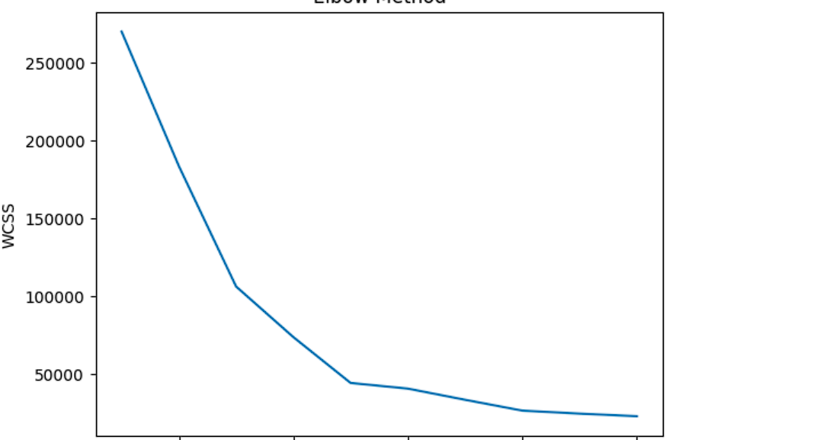
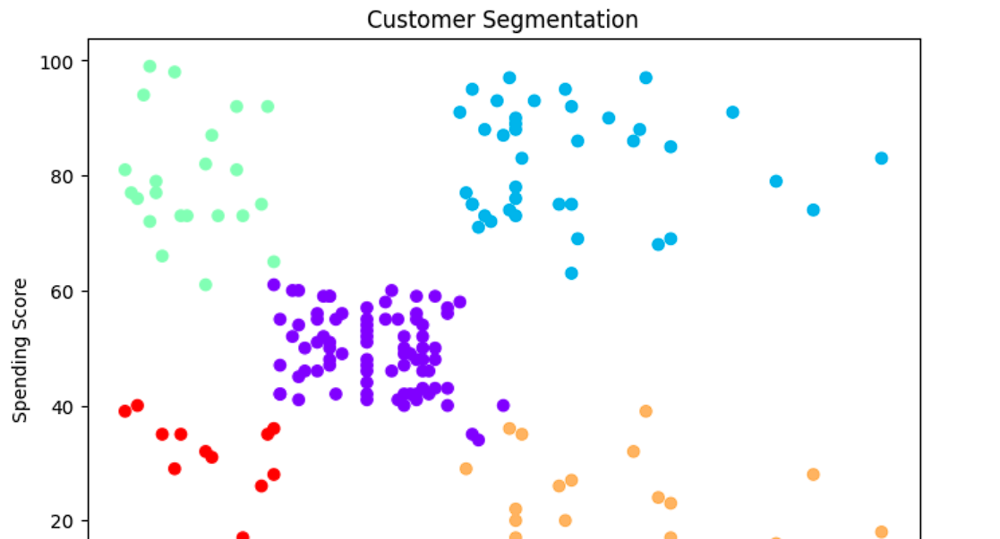

# 🧠 Customer Segmentation using K-Means

## 📌 Project Overview
This project performs customer segmentation using K-Means clustering to group customers based on income and spending behavior.

---

## 🎯 Objective
- Identify different customer groups
- Help businesses target customers effectively

---

## 🛠️ Tools & Technologies
- Python
- Pandas
- Matplotlib & Seaborn
- Scikit-learn

---

## 📂 Dataset
Mall Customers Dataset containing:
- Age
- Gender
- Annual Income
- Spending Score

---

## 🔍 Methodology
- Selected features: Income & Spending Score
- Used Elbow Method to find optimal clusters
- Applied K-Means clustering

---

## 📊 Visualizations

### Elbow Method

### Customer Segmentation

---

## 📈 Results & Insights

- 💎 Premium Customers → High income, high spending  
- 🎯 Target Customers → Low income, high spending  
- ⚖️ Average Customers → Medium income & spending  
- ⚠️ Potential Customers → High income, low spending  
- ❌ Low Value Customers → Low income, low spending  

---

## 🧠 Conclusion
Customer segmentation helps businesses personalize marketing strategies and improve customer retention, enabling companies to better target the right customers.

---

## 🚀 Future Improvements
- Use advanced clustering (DBSCAN)
- Add more features like Age & Gender

---

## 👨‍💻 Author
Akash Prakashan
